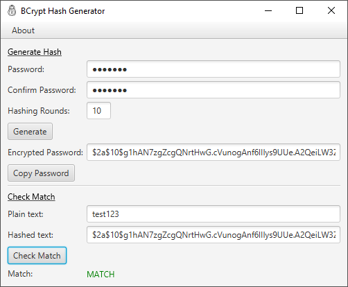

# BCrypt Hash Generator
### JavaFX GUI for creating and validating BCrypt hashes

Simple JavaFX based application to create secure BCrypt hashes. 

BCrypt is a password hashing function that includes a salt to protect from rainbow table
attacks. The hashing rounds (iterations) can be specified in the UI for added security. One
of the unique things that makes BCrypt so secure is that it's an incredibly slow and CPU expensive
algorithm, this makes efforts to crack it futile, as computers get faster, we can just increase the 
iterations to make it more and more difficult for would-be attackers. 



BCrypt generator, apart from the UI, also supports passing multiple plain-text passwords as arguments:
E.g.
```
  java -jar bcrypt-generator.jar somePassword anotherPassword
```
BCrypt Generator will hash the arguments and print them to standard out.